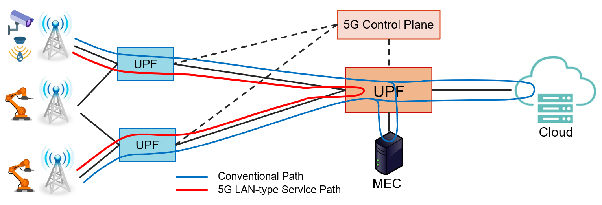

# Welcome to 5G LAN Testbed Repositoy

Hi! This repo contains guidelines and scripts to setup a software-based 5G LAN testbed and run some basic performance evaluations. The testbed was used in our demo paper namely "Demonstration of LAN-type Communication for an Industrial 5G Network". This paper is presented at IEEE INFOCOM 2023, New York, USA.

## Guidelines

There are two guidelines, the first one guide you how to setup the testbed and the second one shows you how to run evaluations.

- [Setup](./Setup.md): Setup a 5G testbed with [UERANSIM](https://github.com/aligungr/UERANSIM) and [Aether platform](https://docs.aetherproject.org)
- [Evaluation](./Evaluation.md): Run performance evaluations with the current testbed

## 5G LAN-type Service

To facilitate the adoption of 5G in industrial networks, 3GPP introduced a new 5G feature called **5G LAN-type service** in Release 16. The 5G LAN-type service aims to support similar functionalities of Local Area Networks, but on top of the 5G network. 5G LAN-type service would be expected to offer UE-to-UE communication with ultra-low latency, which is attractive for localised industrial control settings.

Basically, 5G LAN-type service will enable UE-to-UE communication among devices in the same **_virtual network_** by adding optimized routes in the User Plane Function (UPF) to skip forwarding data to external networks as illustrated in above figure. In our paper, we proposed an approach to implement LAN-type communication in a 5G network and demonstrated the advantage of 5G LAN-type service in terms of E2E latency.

## Reference

The citation information of the paper will be updated later.

## License

The project is licensed under the [Apache License, version 2.0](./LICENSE).
