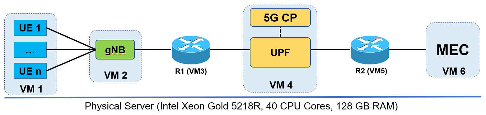
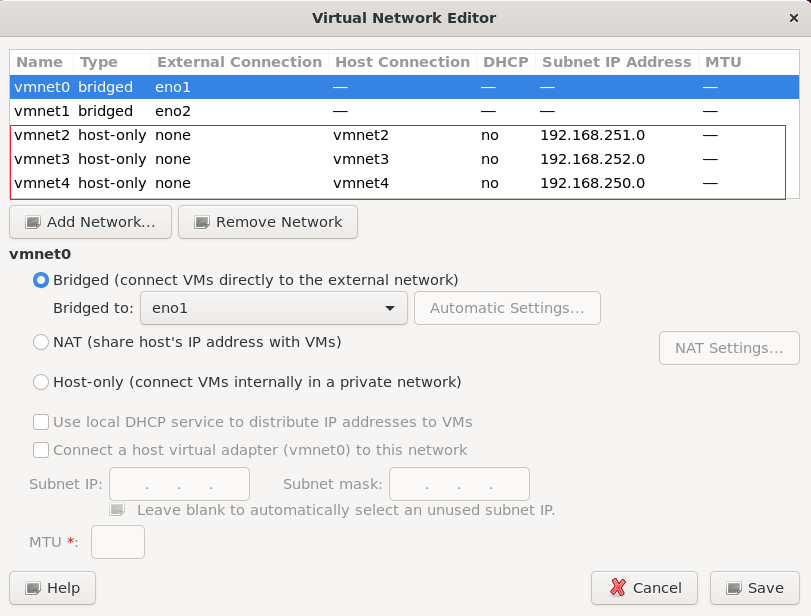

# Setup 5G Testbed

This document will provide steps to setup a 5G testbed based on open-source software. It is assumed that you already gained basic knowledge of Linux OS (Ubuntu), networking, docker, and Kubernetes before starting to setup the testbed.



## Hardware Specifications

In our testbed, we used a single physical server with two Intel Xeon Gold 5218 CPUs (20 core per CPU) and 128GB RAM. The server was installed Ubuntu 20.04 LTS and VMware Workstation Pro v16.2.4 to create virtual machines.

## VM Preparation

We created 6 VMs for the testbed. Below are the settings of each VM

| VM   | CPU | RAM  | NIC                                                                        | Note                                                     |
| ---- | --- | ---- | -------------------------------------------------------------------------- | -------------------------------------------------------- |
| VM 1 | 4   | 8GB  | NIC1: NAT (Internet)<br /> NIC2: RAN Network                               | For installing UE simulation                             |
| VM 2 | 4   | 8GB  | NIC1: NAT (Internet)<br /> NIC2: RAN Network                               | For installing gNB (base station)                        |
| VM 3 | 4   | 8GB  | NIC1: NAT (Internet)<br /> NIC2: RAN Network<br /> NIC3: Access Network    | Router to connect between RAN and Access networks        |
| VM 4 | 20  | 32GB | NIC1: NAT (Internet)<br /> NIC2: Access Network<br /> NIC3: Data Network   | For installing 5G Core                                   |
| VM 5 | 4   | 4GB  | NIC1: NAT (Internet)<br /> NIC2: Data Network<br /> NIC3: External Network | Router to connect between 5G Core and external networks  |
| VM 6 | 8   | 16GB | NIC1: NAT (Internet)<br /> NIC2: External Network                          | For installing applications (act as MEC or cloud server) |

## Network Settings

We need to prepare virtual networks to connect VMs together. Open **Virtual Network Editor** in VMware and create 3 virtual network (vmnet) as below.



Basically, we have 3 seperated networks (subnets) to simulate the real scenario.

RAN Subnet (192.168.252.x): to connect all base stations (gNB) to the Access gateway. Note that VM1 (UE) onlly need to communicate with VM2 (gNB), so we can put VM1 in the RAN subnet also.

Access Subnet (192.168.252.x): to connect all UPFs with the RAN subnet.

Core Subnet (192.168.250x): to connect all core network (UPFs) to external networks (i.e., MEC or internet)


### IP Settings

| VM   | IP Address                                                                                                                                                                             |
| ---- | -------------------------------------------------------------------------------------------------------------------------------------------------------------------------------------- |
| VM 1 | NIC1: NAT (dynamic allocation)<br />NIC2: RAN (static IP)<br />IP: 192.168.251.6 <br />GW: 192.168.251.1                                                                               |
| VM 2 | NIC1: NAT (dynamic allocation)<br />NIC2: RAN (static IP)<br />IP: 192.168.251.6 <br />GW: 192.168.251.1                                                                               |
| VM 3 | NIC1: NAT (dynamic allocation)<br />NIC2: RAN GW (static IP)<br />IP: 192.168.251.1 <br />NIC3: Access GW (static IP)<br />IP: 192.168.252.1                                           |
| VM 4 | NIC1: NAT (dynamic allocation)<br />NIC2: Access (static IP)<br />IP: 192.168.252.3 <br />GW: 192.168.252.1<br />NIC3: Core (static IP)<br />IP: 192.168.250.3 <br />GW: 192.168.250.1 |
| VM 5 | NIC1: NAT (dynamic allocation)<br />NIC2: Core GW (static IP)<br />IP: 192.168.250.1 <br />NIC3: External network (can be NAT or other subnet                                          |
| VM 6 | NIC1: NAT (dynamic allocation)<br />NIC2: MEC IP (static IP)<br />IP: 192.168.250.12 <br />GW: 192.168.250.1                                                                           |

### Notes

- To simlify settings, we allow VM6 to use the same subnnet with VM4, however the communication between UE to MEC server will go through VM1 --> VM2 --> VM3 --> VM4 --> VM5 --> VM6.

- You need to enable IP forwarding in VM3, then it will forward the packets between two subnets (.251.x and .252.x), check ping between VM2 and VM4 to ensure that gNB can communicate with UPF

```
# Edit /etc/sysctl.conf and search for the following lines:
# Uncomment the next line to enable packet forwarding for IPv4
net.ipv4.ip_forward=1
```

## 5G Core Installation

We used the 5G Core network from Aether project 

The guideline to install 5G Core is referred from: https://docs.aetherproject.org/master/developer/aiab.html

To initialize the AiaB environment, first clone the following repository in your home directory:

```
cd ~
git clone "https://gerrit.opencord.org/aether-in-a-box"
cd ~/aether-in-a-box
```

Note that Aether-in-a-Box (AiaB) provides an easy way to deploy Aether’s SD-CORE (5G Core) and other components (gNB, UE) in one server with one physical network interface. To adapt with our testbed design, there are some settings (in Makefile) are needed to update as below table.

### File *Makefile*
| Setting | Default Value | New Value |
| ------ |------|------|
| ENABLE_ROUTER | true | false |
| ENABLE_OAISIM | true | false |
| ENABLE_GNBSIM | true | false |
| GNBSIM_COLORS | true | false |

Delete module $(M)/interface-check during process of installing K8s

```diff
ifeq ($(K8S_INSTALL),kubespray)
-  $(M)/setup: | $(M) $(M)/interface-check
+  $(M)/setup: | $(M)

ifeq ($(K8S_INSTALL),rke2)
-  $(M)/initial-setup: | $(M) $(M)/interface-check
+  $(M)/initial-setup: | $(M)
```
### File *sd-core-5g-values.yaml (omec-user-plane configurations)*
Update the actual name of access and core interfaces in VM4

| Setting | Default Value | New Value |
| ------ |------|------|
| iface (access) | ${DATA_IFACE} | Name of access Inf (NIC 2) |
| iface (core) | ${DATA_IFACE} | Name of core Inf (NIC 3) |


Now run the script to install 5G Core network

To install the ROC using the latest published charts, add CHARTS=latest to the command, e.g.,:

```
CHARTS=latest make 5g-core #override value file -  `~/aether-in-a-box/sd-core-5g-values.yaml`
```

To install the Aether 2.0 release, add CHARTS=release-2.0:
```
CHARTS=release-2.0 make 5g-core  #override value file -  `~/aether-in-a-box/release-2.0/sd-core-5g-values.yaml`
```

Check the pod after the script finish running
```
kubectl get pod --all-namespaces -o wide
```


## UE & RAN Installation
