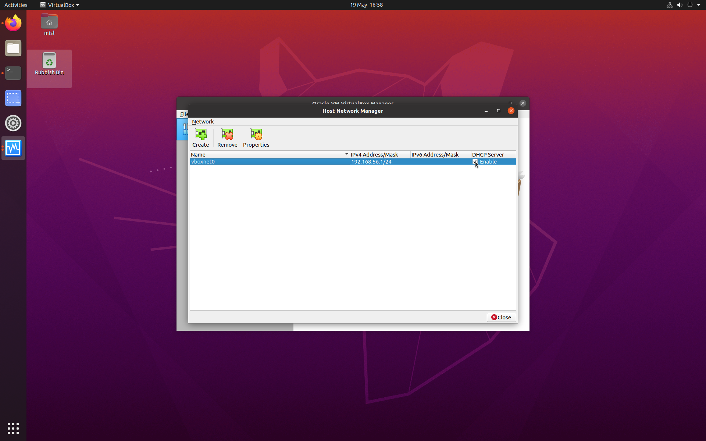

# Setup a 5G Testbed on multiple PC

This document will provide steps to setup a 5G testbed based on open-source software. It is assumed that you already gained basic knowledge of Linux OS (Ubuntu), networking, docker, and Kubernetes before starting to setup the testbed.


## Hardware Specifications

For this testbed intallation you will need **two computers** and a **switch**.
The **first one** will **host** the **5G Core** and **UPF** in a virtual machine via the Aether-In-A-Box open-source implementation. This machine **needs** in the **very least** **12GB of RAM** or else it **won't be able** to **run** the **Virtual Machine**.

The **second computer** can have less RAM. It will **host** the **RAN** and **UE**.

<u>**Both computers needs two physical Network Interfaces for the testbed to work**</u>

The **specific computer** used in this demo are :

- Dell Precision 3620 with Ubuntu 22.04 (Intel Xeon, 12GB RAM and 1TB HDD) to host the UPF and 5G core.
- Dell Optiplex 990 with Ubuntu 20.04 (Intel i3, 8GB RAM and 500GB HDD) to host the RAN and UE.

## UPF & 5G Core installation

### Setup the host machine

*You need to do these steps on the machine with at least 12GB RAM*

First of all, if you are in UCC you will need to folow [these steps](SetupUCCProxy.md) to setup the proxy.

You will then need to setup the ip adress of the physical interface on the host machine. Here are the steps to do it : 

- Frist click on the upper right corner and access the computer network settings


- Then click on the settings of the physical interface that isn't used for the internet connection


- Select the IPv4 settings and select Manual


- And fill the IPv4 address as such 
  **Address** : *192.168.252.101*
  **Netmask** : *255.255.255.0*
  **Gateway** : *192.168.252.1*


- Then click on "*Apply*" and then on the switch button to enable the interface and you should be good to go.


At this point you should run the following command and note the name of the interface as it will be useful for the configuration of the network of the virtual machine.

```bash
ip a | grep 192.168.252.101
```

In my case the result of the command is :

```bash
inet 192.168.252..101/24 brd 192.168.255.255 scope global noprefixroute enp2s0
```

So the name of the interface is **enp2s0**.

#### VirtualBox installation

Now, you will need to install  VirtualBox. Here are the commands you need to run if you use:

###### apt

```bash
sudo apt update -y && apt upgrade -y
sudo apt install -y virtualbox
```

###### apt-get

```bash
sudo apt-get update -y && apt upgrade -y
sudo apt-get install -y virtualbox
```

#### VirtualBox network configuration

Here are the steps you need to follow to setup the virtual network.

- First you will need to create the */etc/vbox/networks.conf* configuration file

```bash
sudo mkdir /etc/vbox
sudo touch /etc/vbox/networks.conf
```

- Then you add the accepted range for the host networks inside the configuration file

```bash
sudo echo '* 192.189.0.0/16' >> /etc/vboc/networks.conf
```

- Now launch VirtualBox with this command :

```bash
virtualbox
```

After that, you should be prompted with such window : 


- Click on the upper left corner and select "*Host Network Manager*"


Another window should appear

- In the new window, hit "*Create*"


- Then select the new network that was just created and disable the DHCP



- Now click on "*Properties*"


- Setup the IPv4 adress to *192.168.250.1*


- Then hit Apply (you may have to apply once, setup the IPv4 adress again and then apply again )


- Now you can close the "*Host Network Manager*" window. 
Well done you have setup the virtual network.

#### Virtual machine creation

To create the Virtual machine you will first need to install the Linux ISO. In this tutorial we will use Ubuntu 22.04.3 LTS.

You will need to go on the [Ubuntu website](https://ubuntu.com/download/desktop) and download the ISO.

Once I downloaded the ISO i move it in a folder called *VM* in my home directory but this is stricly optional and just to organize my files.

```bash
mkdir ~/VM
mv ~/Downloads/ubuntu-22.04.3-desktop-amd64.iso ~/VM
```

Now go back to VirtualBox and here are the steps that you will need to follow to create the VM :

- Click on "*New*"


- Name the VM as you want and choose wichever folder pleases you to install the VM into.
    **Select "*Linux*" as the type and "*Ubuntu (64-bit)*" as the version**
    Click on "*Next*"


- Select the amount of RAM you want to allocate to the VM.
   **You will need at least 11085MB of RAM**.
    Click on "*Next*"


- Select "*Create a virtual hard disk now*"
    Click on "*Create*"


- Select "*VDI (VirtualBox Disk Image)*"
    Click on "*Next*"


- Select "*Dynamically allocated*"
    Click on "*Next*"


- Select the amount of storage you want to allocate to the VM.
    **I recommend using at least 100GB of storage.**
    Click on "*Create*"


Congratulation, the VM is created. Now you will need to configure it.

### Virtual machine configuration (in VirtualBox)

- Select the VM you just created and click on "*Settings*"


- Go to "*System*"
  


- Go to "*Processor*" and select the number of CPU you want to allocate to the VM.
    **I recommend using at least 4 CPU.**
    Click on "*OK*"


- Go to "*Network*"


- Select "*Adapter 2*" and enable the Network Adapter


- Select "*bridged adapter*" as the "*Attached to*" option


- Select the name of the interface you noted earlier in the "*Name*" option


- Click on "*advanced*"


- Select "*Allow All*" in the "*Promiscuous Mode*" option


- Repeat the exact same steps for the Adadpter 3

- Then click on adatper 4, enable it and select "*host-only adapter*" as the "*Attached to*" option
  You should have only one host-only network to chose in the "*Name*" option, the one we created earlier.


- Select "*Allow All*" in the "*Promiscuous Mode*" option


- Click on "*OK*". Well done, the VM is now configured.

You can now launch the VM and install Ubuntu on it.

### Ubuntu installation

- Select the VM you just created and click on "*Start*"


- Click on the little arrow next to the "*Select a start-up disk*" option


- Click on "*Add*" and select the ISO you downloaded earlier


- Select the newly added ISO and click on "*Choose*"


- Click on "*Start*"


- Select "*Try or Install Ubuntu*"

Now you will install Ubuntu, there are a lot of tutorials on the internet to do so, I will not cover this part. (A good tutorial is available [here](https://phoenixnap.com/kb/install-ubuntu-20-04#ftoc-heading-7) (We are already at step 5))

#### Quality Of Life upgrade

Here is just a little QOL upgrade while using the VM, I recommend inserting the guest additions CD. It will allow you to use the VM in full screen and to copy/paste between the host and the VM.

- Click on "*Devices*" and then "*Insert Guest Additions CD image*"


- If you havent downloaded it already, click on "*Download*" and then "*Insert*"

- Then double click on the Disk on the desktop


- Then on the newly oppened file window, right click on the "*AutoRun.sh*" and select "*Run as program*"


- Enter your password, follow the instructions and restart the VM.
    You can now use the VM in full screen and copy/paste between the host and the VM !


### Virtual Machine configuration (in Ubuntu)

Now that we have a clean installation of Ubuntu we will setup the VM so that we will be able to install and run the UPF on it.

#### Network configuration

First of all, if you are in UCC you will need to folow [these steps](SetupUCCProxy.md) to setup the proxy.

The Virtual Machine will have 4 network Interfaces : 
- enp0s3 : NAT (this is the one that as acces to internet and is the only one with the status *connected*)
- enp0s8 : Host-only (This will be set up automatically when we set up the UPF)
- enp0s9 : Bridged (This is the one you need to setup manually)
- enp0s10 : Host-only (This will be set up automatically when we set up the UPF)

So you will need to manually setup the IPv4 adress of the enp0s9 network Interface. It is the exact same steps as the ones we did for the host machine. Except this time the ip address will be *192.168.252.202*.

#### Programs intallation

Now, you will need to install some programs that will be necessary to install the UPF & 5G Core. Here are the commands you need to run if you use:

###### apt

```bash
sudo apt update -y && apt upgrade -y
sudo apt install -y curl g++ gcc git make net-tools
```

###### apt-get

```bash
sudo apt-get update -y && apt upgrade -y
sudo apt-get install -y  curl g++ gcc git make net-tools
```


#### UPF & 5G Core installation

We will use the 5G Core network from Aether project

The guideline to install 5G Core is referred from: https://docs.aetherproject.org/master/developer/aiab.html

To initialize the AiaB environment, first clone the following repository in any directory you want:

```bash
git clone "https://gerrit.opencord.org/aether-in-a-box"
cd ~/aether-in-a-box
```

Note that Aether-in-a-Box (AiaB) provides an easy way to deploy Aether’s SD-CORE (5G Core) and other components (RAN, UE) in one server with one physical network interface. To adapt with our testbed design, some settings (in the Makefile) are needed.


##### UPF & 5G Core configuration

###### Makefile

First of all, open the *Makefile* file with your favorite text editor and edit the following lines:

* lines 35-44 (the changed ones are 35-37, 39 and 44):

```diff
-   ENABLE_ROUTER ?= true	
+   ENABLE_ROUTER ?= false	
-   ENABLE_OAISIM ?= true	
+   ENABLE_OAISIM ?= false	
-   ENABLE_RANSIM ?= true	
+   ENABLE_RANSIM ?= false
    ENABLE_SUBSCRIBER_PROXY ?= false	
-   RANSIM_COLORS ?= true
+   RANSIM_COLORS ?= false
    K8S_INSTALL ?= rke2	
    CTR_CMD     := sudo /var/lib/rancher/rke2/bin/ctr --address /run/k3s/containerd/containerd.sock --namespace k8s.io	
-   PROXY_ENABLED   ?= false
+   PROXY_ENABLED   ?= true
```

* line 146

```diff
-   $(M)/setup: | $(M) $(M)/interface-check
+   $(M)/setup: | $(M) 
```

* line 153

```diff
-   $(M)/initial-setup: | $(M) $(M)/interface-check
+   $(M)/initial-setup: | $(M)
````

* lines 489-490

```diff
-               atomix \	
+               atomix-runtime \
-               $(ATOMIX_CHART); \
+               $(ATOMIX_RUNTIME_CHART); \
```

###### aether-2.1/sd-core-5G-values.yaml

Now go in the *aether-2.1* folder, open the file *sd-core-5G-values.yaml* and edit the following lines:

* line 55-60

```diff
    amf:	
+     serviceType: NodePort
      # use externalIP if you need to access your AMF from remote setup and you don't	
      # want setup NodePort Service Type	
+     sbi:
+       port: 29518
+       nodePort: 30088
-     #ngapp:
+     ngapp:
        #externalIp: "128.110.219.37"	
-       #port: 38412
+       port: 38412
+       nodePort: 30071
```

* line 248-258 (should be 253-263 if you did the previous changes)

```diff
-       cniPlugin: macvlan
+       cniPlugin: "host-device"
        ipam: static	
        routes:	
          - to: ${NODE_IP}	
            via: 169.254.1.1	
        enb:	
          subnet: ${RAN_SUBNET} #this is your RAN network	
        access:	
-         iface: ${DATA_IFACE}	
+         iface: enp0s8
        core:	
-         iface: ${DATA_IFACE}
+         iface: enp0s10
```

#### Running the UPF & 5G Core

Now run the script to install 5G Core network

```bash
CHARTS=release-2.1 make 5g-core  #override value file -  `~/aether-in-a-box/release-2.1/sd-core-5g-values.yaml`
```

After the script has finished running you can try to check the pods with this command (note that the pods may still need a bit of time to finish intallation and show a value of "running"):

```bash
kubectl get pod --all-namespaces -o wide
```

## RAN & UE installation


You need to do these steps on the other machine*

First of all, if you are in UCC you will need to folow [these steps](ProxySetup.md) to setup the proxy.

You will then need to setup the ip adress of the physical interface on the host machine to **192.168.252.102**. 
(These are the same steps as described before so i won't detail them again)

#### Programs intallation

You will need to install some programs that will be necessary to install the RAN & UE. Here are the commands you need to run if you use:

###### apt

```bash
sudo apt update -y && apt upgrade -y
sudo apt install -y git make gcc g++ iproute2 libsctp-dev lksctp-tools libssl-dev openssl wget
cd ~
wget cmake-3.26.4.tar.gz
tar -zxvf cmake-3.26.4.tar.gz
cd ~/cmake-3.26.4
./bootstrap
make
sudo make install
cd ~
```

###### apt-get

```bash
sudo apt-get update -y && apt upgrade -y
sudo apt-get install -y  git make gcc g++ iproute2 libsctp-dev lksctp-tools libssl-dev openssl wget
cd ~
wget cmake-3.26.4.tar.gz
tar -zxvf cmake-3.26.4.tar.gz
cd ~/cmake-3.26.4
./bootstrap
make
sudo make install
cd ~
```

#### RAN & UE installation

To install the RAN & UE, we will use the UERANSIM open source state-of-the-art 5G UE and RAN simulator by ALİ GÜNGÖR.
First, you will need to clone the UERANSIM repository in any directory you want and enter the reposiroty:

```bash
git clone http://github.com/aligungr/UERANSIM
cd UERANSIM
```

Then, you can *make* the UERANSIM with the following command:

```bash
make
```

#### RAN & UE configuration

Now you will need to configure the RAN & UE. 

First, we will configure the RAN. 
To do so, you will need to go to the *config* folder and copy the *free5GC-gnb.yaml* file and give it another name, here we will call it my-gnb.yaml:

```bash
cd config
cp free5GC-gnb.yaml my-gnb.yaml
```

Then, you will need to edit the *my-gnb.yaml* file with your favorite text editor and edit the following lines:

```diff
	mcc: '208'          # Mobile Country Code value	
    mnc: '93'           # Mobile Network Code value (2 or 3 digits)	

    nci: '0x000000010'  # NR Cell Identity (36-bit)	
    idLength: 32        # NR gNB ID length in bits [22...32]	
    tac: 1              # Tracking Area Code	

-   linkIp: 127.0.0.1   # gNB's local IP address for Radio Link Simulation (Usually same with local IP)	
+   linkIp: 0.0.0.0   # gNB's local IP address for Radio Link Simulation (Usually same with local IP)	
-   ngapIp: 127.0.0.1   # gNB's local IP address for N2 Interface (Usually same with local IP)	
+   ngapIp: 192.168.252.102   # gNB's local IP address for N2 Interface-Control Plane (Usually same network with AMF service)
-   gtpIp: 127.0.0.1    # gNB's local IP address for N3 Interface (Usually same with local IP)	
+	gtpIp: 192.168.252.102   # gNB's local IP address for N3 Interface-Data Plane (Usually same network with UPF service)
    # List of AMF address information	
    amfConfigs:	
-     - address: 127.0.0.1	
+     - address: 192.168.252.202 # IP address of 5G core VM
-       port: 38412	
+       port: 30071  # node-port mapping of 5G AMF service
    # List of supported S-NSSAIs by this gNB	
    slices:	
      - sst: 0x1	
        sd: 0x010203	
    # Indicates whether or not SCTP stream number errors should be ignored.	
    ignoreStreamIds: true
```

Then, you will need to configure the UE.

To do so, you will need to copy the *free5GC-ue.yaml* file and give it another name, here we will call it my-ue1.yaml:

```bash
cp free5GC-ue.yaml my-ue1.yaml
```

Then, you will need to edit the *my-ue1.yaml* file with your favorite text editor and edit the following lines:

```diff
    # IMSI number of the UE. IMSI = [MCC|MNC|MSISDN] (In total 15 digits)	
-   supi: 'imsi-208930000000003'
+   supi: 'imsi-208930100007487'
    # Mobile Country Code value of HPLMN	
    mcc: '208'	
    # Mobile Network Code value of HPLMN (2 or 3 digits)	
    mnc: '93'	
-   # SUCI Protection Scheme : 0 for Null-scheme, 1 for Profile A and 2 for Profile B	
-   protectionScheme: 0	
-   # Home Network Public Key for protecting with SUCI Profile A	
-   homeNetworkPublicKey: '5a8d38864820197c3394b92613b20b91633cbd897119273bf8e4a6f4eec0a650'	
-   # Home Network Public Key ID for protecting with SUCI Profile A	
-   homeNetworkPublicKeyId: 1	
-   # Routing Indicator	
-   routingIndicator: '0000'	
    # Permanent subscription key	
-   key: '8baf473f2f8fd09487cccbd7097c6862'
+   key: '5122250214c33e723a5dd523fc145fc0'
    # Operator code (OP or OPC) of the UE	
-   op: '8e27b6af0e692e750f32667a3b14605d'	
+   op: '981d464c7c52eb6e5036234984ad0bcf'
    # This value specifies the OP type and it can be either 'OP' or 'OPC'	
    opType: 'OPC'	
    # Authentication Management Field (AMF) value	
    amf: '8000'	
    # IMEI number of the device. It is used if no SUPI is provided	
-   imei: '356938035643803'
+   imei: '208930100007487'
    # IMEISV number of the device. It is used if no SUPI and IMEI is provided	
    imeiSv: '4370816125816151'	

...
```

If you want to create other UE, you will need to copy the *my-ue1.yaml* file and give it another name, here we will call it my-ue2.yaml:

```bash
cp my-ue1.yaml my-ue2.yaml
```

Then, you will need to edit the *my-ue2.yaml* file with your favorite text editor and change the *supi* and *imei* values. For ecample :

```diff
...
    
-   supi: 'imsi-208930100007487'
+   supi: 'imsi-208930100007488'

...

-   imei: '208930100007487'
+   imei: '208930100007488'

...
```


#### Running the RAN & UE

Now you can run the RAN & UE with the following commands in two different bash instances:

```bash
cd ../build
sudo ./nr-gnb -c ../config/my-gnb.yaml
```

```bash
cd ../build
sudo ./nr-ue -c ../config/my-ue.yaml
```

Well done! You have now a running 5G RAN & UE.

