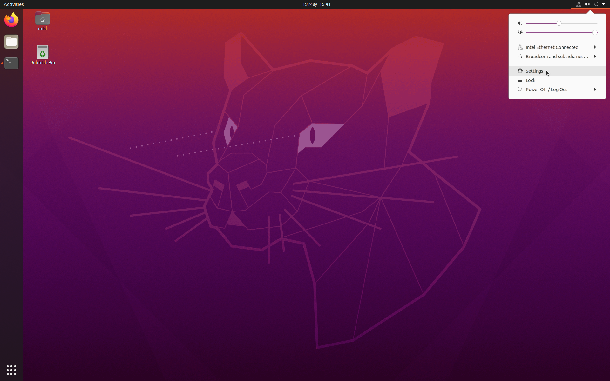
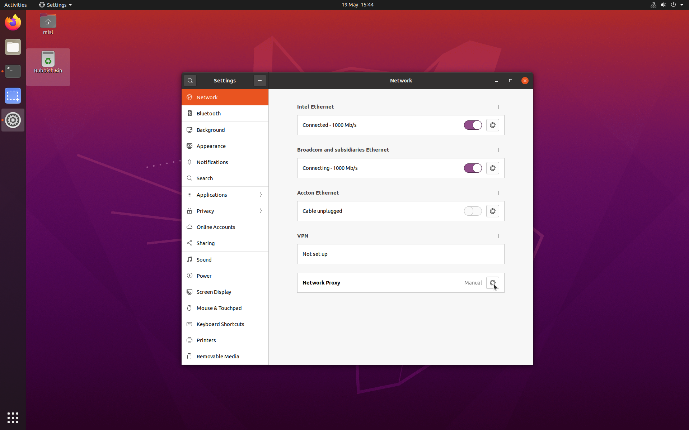
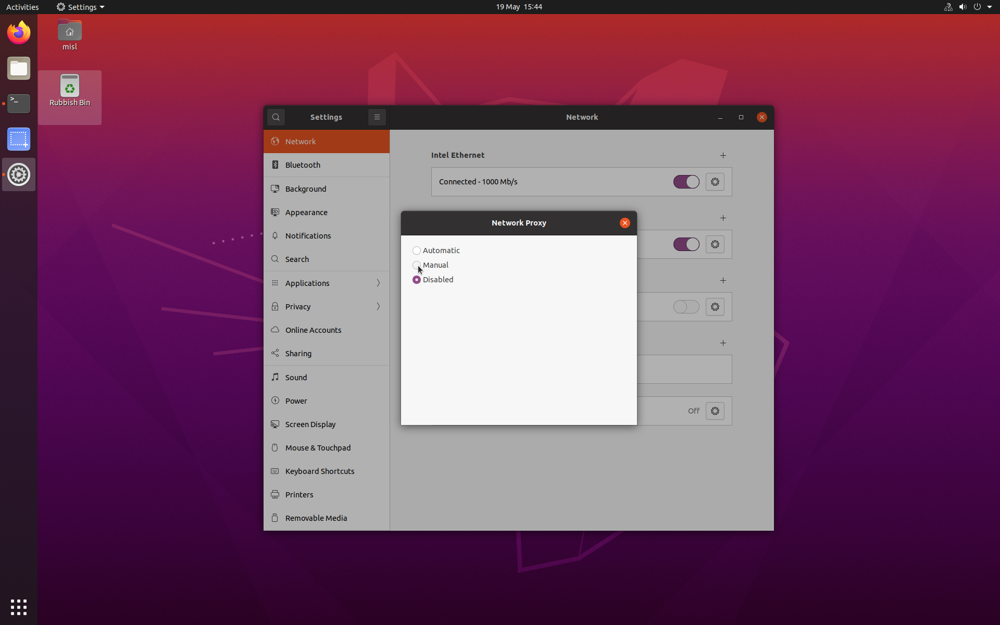
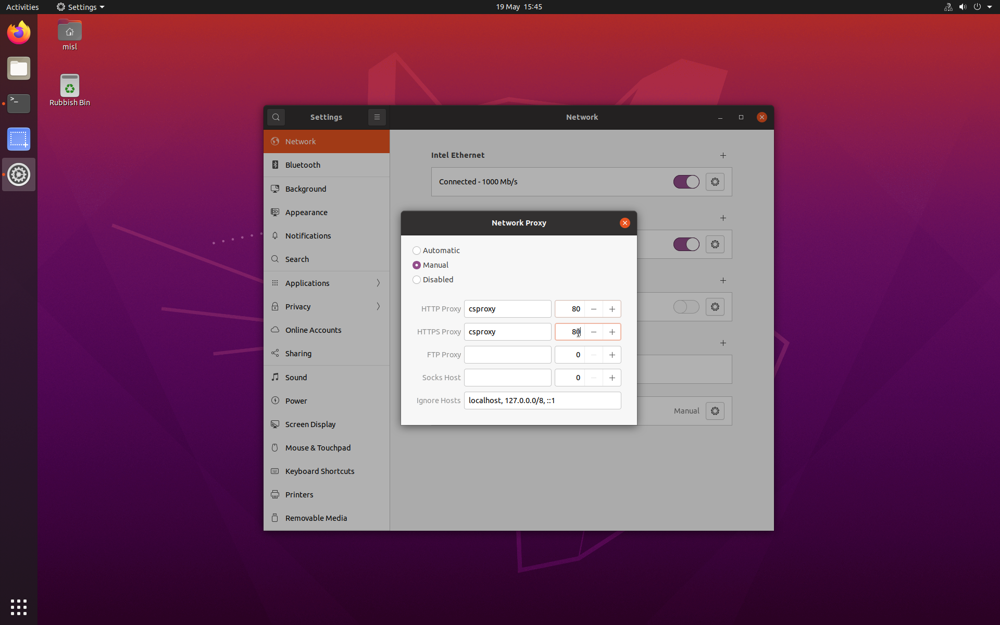

#UCC Proxy Setup

##Global

First of all you will need to configure the proxy via the GUI. 
Here are the detailed steps :

- First click in the upper right coner and access the computer network settings 



- Then click on the proxy settings



- Select the Manual setting mode



- And fill the http and https proxy as such
 (HTTP & HTTPS proxy : *csproxy.ucc.ie* and port is 80 )




##bashrc

Then you will need to configure the proxy in the *~/.bashrc* file.
Here is how to do it :

```bash
sudo echo 'export http_proxy=csproxy.ucc.ie:80' >> ~/.bashrc
sudo echo 'export https_proxy=csproxy.ucc.ie:80' >> ~/.bashrc
source ~/.bashrc
```

##apt
Finally, you'll need to configure the ucc proxy for apt.
Here are the command to do it :

```bash
sudo su
echo 'Acquire::http::Proxy "http://csproxy.ucc.ie:80/";' >> /etc/apt/apt.conf.d/proxy.conf 
echo 'Acquire::https::Proxy "https://csproxy.ucc.ie:80/";' >> /etc/apt/apt.conf.d/proxy.conf
exit
sudo apt update -y && sudo apt upgrade -y 
```
